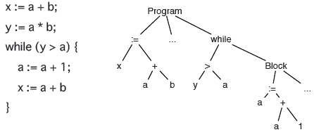

.. ipython:: python
    :suppress:

    import sys
    sys.path.append("..")

    import redbaron
    redbaron.ipython_behavior = False
    from redbaron import RedBaron

Learn how to use RedBaron
=========================

This tutorial guides you through the big principles of RedBaron and
highlights the most useful helpers and tricks. It is more or less
a lighter version of the already existing documentation.

A reminder before starting:

* **RedBaron doesn't do static analysis** and will never do (but it's
  very likely that it will be combined with tools that do it, like
  astroid or rope, to bring static analysis into RedBaron or easy source
  code modification in the others)

The structure of this tutorial is similar to the documentation's:

* basic principles and how to use it in a shell
* how to query the tree
* how to modify the tree
* how to play with list of things
* miscellaneous but useful stuff

Basic principles
----------------

Input and output with the source code in a string:

.. code-block:: python

    from redbaron import RedBaron

    red = RedBaron("code source as a string")
    red.dumps()

Input and output with the source code in a file:

.. code-block:: python

    from redbaron import RedBaron

    with open("code.py", "r") as source_code:
        red = RedBaron(source_code.read())

    with open("code.py", "w") as source_code:
        source_code.write(red.dumps())

Now that you know how to load your code into RedBaron, let's talk about its principles:

* RedBaron represents the source code as a tree. This is because when you are writing source code (of any classical language), you are actually writing a tree structure in the source file.
* For example: in :file:`1 + 2` the top node is :file:`+`, the left one is :file:`1` and the right one is :file:`2`.
* In :file:`(1 + 2) + 3` the top node is, again, :file:`+`, but the left one is actually :file:`(1 + 2)` which is again another :file:`+` node! This structure *is* a tree.
* The classical approach to handle such a structure is to use an `Abstract Syntax Tree (AST) <https://en.wikipedia.org/wiki/Abstract_syntax_tree>`_ (it is used by compilers and interpreters like cpython).
* RedBaron, by relying on `Baron <https://github.com/PyCQA/baron>`_, uses a *Full* Syntax Tree (FST). It's like an AST except it keeps every information, included formatting, and is then a lossless representation of the source code. Under the hood, the FST produced by Baron is in JSON and has been thought to be read and used by humans (although not as easily as RedBaron).
* So, when BeautifulSoup wraps the HTML datastructure into objects, RedBaron does the same thing for the FST datastructure and provides a nice way to interact with the source code.

Example of an AST for some language that looks like Go:

While you don't have to do that to use RedBaron on a daily basis, seeing
the produced FST can help your understand RedBaron better (every key
that has "_formatting" in its name is formatting related):

.. ipython:: python

    import json

    red = RedBaron("1+2")
    print(json.dumps(red.fst(), indent=4))  # json.dumps is used for pretty printing

Use it in a shell
-----------------

Now that we stated the concept of the source code as a tree, let's explore it.

First, like BeautifulSoup, when used in a shell RedBaron displays the currently
selected source code, so you'll have a direct idea of what you are working on:

.. ipython:: python

    red = RedBaron("stuff = 1 + 2\nprint 'Beautiful result:', stuff ")
    red

You might notice the :file:`0` and the :file:`1` on the left: those are the
indexes of the 2 nodes in the root of the source code. In fact, a source code is
a list of statements so the root node :file:`red` is a list. See by yourself:

.. ipython:: python

    red[0]
    red[1]

But now, how to access the attributes? Since reading the doc for every node is
boring, RedBaron comes with a helper method that shows you the underlying
structure of the currently selected nodes:

.. ipython:: python

    red[0]
    red[0].help()

The output might be a bit scary at first, but it's simply showing you the
underlying structure, mapped to Baron JSON's one.

*By the way, RedBaron has nice coloration features if you use ipython as
your python shell.*

Let's take it step by step:

* We are on an :file:`AssignmentNode` (something like :file:`a = b`) that has 3 attributes: :file:`operator`, :file:`target` and :file:`value`.
* The :file:`operator` is an empty string (it could have been a python operator like :file:`+` in a case like :file:`a += b`)
* :file:`target` points to another node, a :file:`NameNode` (you can see this thanks to the arrow :file:`->` instead of an equal sign :file:`=`)
* :file:`value` points to a :file:`BinaryOperatorNode`.

To get more information about all the existing kind of nodes, see the
documentation: :doc:`nodes_reference`.

Let's try it:

.. ipython:: python

    red[0]
    red[0].operator
    red[0].target
    red[0].value

For now we saw attributes that are either strings or pointing to other
nodes, respectively called leafs and branches in the tree terminology.
The last kind of attributes that you will encounter are a special case
of the branch nodes: instead of pointing to a single node, they point to
a list of nodes. You can see this in the print statement's :file:`value`
attribute:

.. ipython:: python

    red[1].help()

Notice the :file:`*` before :file:`StringNode` and :file:`NameNode`? It
indicates that they are items of a list. Look:

.. ipython:: python

    red[1]
    red[1].value
    red[1].value[0]
    red[1].value[1]

And if we show the help of the value attribute, we clearly see that
there is a list of nodes.

.. ipython:: python

    red[1].value.help()

This is similar for the root node, which is itself also a list of nodes:

.. ipython:: python

    red.help()

And *voilà*, you now know how to navigate the tree by attributes without having
to read any documentation!

If you're curious about the :file:`identifiers` outputted by the
:file:`.help()` method, read on to the next section.

And one last thing: by default :file:`.help()` stops at a certain
"deepness level" and displays :file:`...` instead of going further. To
avoid that, simply pass an integer that indicates the "deepness level"
you want, or give :file:`True` if you want to display the whole tree.

::

    red.help(4)
    red.help(True)

You can read the whole documentation of :file:`.help` here: :ref:`help()`

Querying
--------

Querying is inspired by BeautifulSoup. You have access to 2 methods:
:file:`.find` and :file:`.find_all`, accepting the same arguments. The
first one returns the first matched node and the second one returns
the list of all the matched nodes.

The first argument is a string that represent the kind of the node you
want to match on. The :file:`identifiers` section displayed by the
:file:`.help()` method shows you several strings you can use to identify
a kind of node. For example:

.. ipython:: python

    red
    red.help()
    red.find("assignment")
    red.find("print")
    red.find_all("int")

Then, you can pass as many keyword arguments as you want. They will
filter the returned list on the attributes of the node and keep only
those matching all attributes:

.. ipython:: python

    red.find("int", value=2)

The only special argument you can pass is :file:`recursive` that determine if
the query is done recursively. By default it is set at :file:`True`, just pass
:file:`recursive=False` to :file:`.find` or :file:`.find_all` to avoid that.

Queries are very powerful: you can pass lambdas, regexes, a short hand syntax for
regexes and globs, a tuple of string instead of a string for the node kind, a
global regex that receives the node (instead of a regex per attribute), etc.
You can read all of that in the documentation: :doc:`querying`.

Finally, :file:`.find` and :file:`.find_all` also have a shortcut syntax (exactly like
in BeautifulSoup):

.. ipython:: python

    red.find("int")
    red.int

    red.find_all("int", value=2)
    red("int", value=2)

But be aware that if you do a
:file:`red.something_that_can_be_a_node_identifier` and this is also not an
attribute of a node, this will raise an :file:`AttributeError`.

Modification
------------

Nodes modification is extremely simple in RedBaron: you just have to set the
attribute of the node you want to modify with a string containing python source
code. Just look by yourself:

.. ipython:: python

    red
    red[0].target = "something_else"
    red[0].value = "42 * 34"
    red
    red[1].value = "'Hello World!'"
    red

Notice that this also works with complex attributes like the body of a
function. Here RedBaron makes a lot of effort to correctly format your input so
you can pass it pretty much anything:

.. ipython:: python

    red = RedBaron("def a():\n    pass")
    red[0].value = "1 + 1"
    red  # correctly indented
    red[0].value = "\n\n\n           stuff\n"
    red  # again

And this works too for more complex situations where the node is indented and
followed by another node whose indentation can't be broken and
other low level details that you don't want to hear about (but if you wish
too, this is detailed in the full documentation).

And *voilà*, easy source code modification! You can also pass RedBaron node
objects or Baron JSON FST that you have obtain is some way or another, for example by
using :file:`.copy()`:

.. ipython:: python

    red = RedBaron("stuff = 1 + 2\nprint(stuff)")
    red
    i = red[0].value.copy()
    red[1].value = i
    red

You can also replace a node *in place* using the :file:`.replace()` method.
**Warning**: the :file:`.replace()` expects that the string you pass
represents a whole valid python program (so for example: :file:`.replace("*args,
**kwargs")` won't work). This limitation should be raised in the future.

.. ipython:: python

    red
    red[0].value.replace("1234")
    red

This is generally very useful when working on queries. For example (a real life
example), here is the code to replace every :file:`print stuff` (prints
statement of **one** argument, an example with multiple arguments is left as an exercise to the
reader) with :file:`logger.debug(stuff)`:

::

    red("print", value=lambda x: len(x) == 1).map(lambda x: x.replace("logger.debug(%s)" % x.value.dumps()))

(:file:`.map()` will be covered at the end of the tutorial but should speak for itself.)

You can read everything about modifications in RedBaron here: :doc:`modifying`

Playing with list of nodes
--------------------------

The last big concept of RedBaron covered in this tutorial is how to handle list of nodes. The problem for
short is that, for a python developer, the list :file:`[1, 2, 3]` has 3 items
but it has 5 items in the FST world, because it needs to take into account
the commas. It is not sufficient to know that it is a comma separated
list because each comma can have a different formatting. This is
a pattern you find in every list of nodes, the separator being
either commas, dots (eg: :file:`a.b(c)[d]`) or end of line characters (for
lines of code).

Having to deal with those separators is extremely annoying and error
prone, so, RedBaron offers an abstraction that hides all this for you!
You just have to deal with those list of nodes like if they were regular
python list and everything will be fine. See by yourself:

.. ipython:: python

    red = RedBaron("[1, 2, 3]")
    red.help()
    red[0].value  # see: no explicit commas to deal with
    red[0].value.append("4")
    red  # comma has been added for us

This abstraction is called a proxy list. They can even detect
indentation style for comma separated lists:

.. ipython:: python

    red = RedBaron("[\n    1,\n    2,\n    3,\n]")
    red
    red[0].value.append("caramba")
    red

This also work with nodes separated by dots:

.. ipython:: python

    red = RedBaron("a.b(c)[d]")
    red
    red[0].value.extend(["e", "(f)", "[g:h]"])
    red

And lines of code (note that the blank lines are explicitly shown and it
is intended as such, see the documentation for more information:
:doc:`proxy_list`):

.. ipython:: python

    red = RedBaron("a = 1\n\nprint(a)")
    red
    red.insert(1, "if a:\n    print('a == 1')")
    red

The important things to remember are that:

* Every method and protocol of python lists (except :file:`sort` and :file:`reversed`) works on proxy list.
* And every node list in python is wrapped by a proxy list.

The raw list is stored on the :file:`.node_list` attribute of the proxy list:

.. ipython:: python

    red = RedBaron("[1, 2, 3]")
    red[0].node_list

**Warning**: the proxyfied list and the proxy list are only synced from the proxy
list to the raw list. If you start to modify the raw list, don't
use the proxy list anymore or you'll have strange bugs! This might change in
the future.

One last thing: if the proxy list is stored on the :file:`.value` attribute,
you can directly call the methods on the holder node.
This is done because it is more intuitive, see by yourself:

::

    red = RedBaron("[1, 2, 3]")

    red[0].append("4")  # is exactly the same than the next line
    red[0].value.append("4")

Misc things
-----------

A short list of useful features of RedBaron:

* :file:`.map`, a method of RedBaron lists that takes a callable (like a lambda or a function), apply it to every one of its members and returns a RedBaron list containing the result of the call
* :file:`.apply` same than :file:`.map` except it returns a RedBaron list of the nodes on which the callable has been applied (i.e. the members before the call instead of the members after the call) (for simplicity we uses the :file:`int` builtin function here, you might want to look at :file:`to_python` in the future for a more generic conversion operation)

.. ipython:: python

    red = RedBaron("[1, 2, 3]")
    red("int").map(lambda x: int(x.value) + 42)
    red("int").apply(lambda x: int(x.value) + 42)

* :file:`.filter`, another method of RedBaron list, it takes a callable and return a RedBaron list containing the nodes for which the callable has returned True (or something that is tested has True in python)

.. ipython:: python

    red = RedBaron("[1, 2, 3]")
    red("int").filter(lambda x: int(x.value) % 2 == 1)  # odd numbers

* :file:`.next` gives the node just after the current one if the node is in a list
* :file:`.previous` does the inverse
* :file:`.parent` gives the holder of this node

.. ipython:: python

    red = RedBaron("[1, 2, 3]")
    red.int_
    red.int_.next
    red.int_.previous  # None because nothing is behind it
    red.int_.parent

And you can find all the others various RedBaron features here: :doc:`other`
